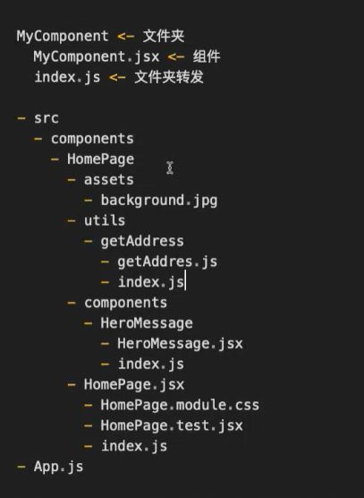

# Lecture 11 React（3）

本篇笔记以 Zhao Long 老师的 Lecture 11 React (Part 3) 的课堂内容整理的随堂笔记

## Table of Contents

1. [回顾上节课](#1回顾上节课)
2. [关于 create-react-app 脚手架](#2-关于-create-react-app-脚手架)
3. [理解 JSX 的语法和作用](#3-理解-jsx-的语法和作用)
   - [3.1. 数组映射](#31-数组映射)
   - [3.2. 条件渲染](#32-条件渲染)
   - [3.3. 变量注入](#33-变量注入)
4. [组件](#4-组件)
   - [4.1. 函数组件](#41-函数组件function-component)
   - [4.2. 类组件](#42-类组件class-component)
   - [4.3. 高阶组件](#43-高阶组件high-order-component)

##职业规划部分
- Graduated: 不理解高质量代码
- Junior: 理解高质量代码，不能有效产出。自我驱动 -> 短线投资回报（快速爬到mid、senior的能力），学习能力     
- Mid: 理解高质量代码，能有效产出，不能带团队。      
- Senior: 理解高质量代码，能有效产出，能指导团队。但是没办法有效解决核心问题。（代码能力VS项目经验， 5 Years Vision, 应对5年内可能出现的问题）
- Principle/ Staff: 能有效解决核心问题（技术革新等）。
- 管理路线&技术路线 Tech Lead: 调用资源解决核心问题。        
- 管理路线：Team Lead。  

> 澳洲不能只会做不会说，不然你就在mid卡死了。
       
> 第一份工作最好是往下降一级，比如以mid水平来面junior。第一份工作会比正常找工作难的多。

## 1.回顾上节课    

- React
  - 一个专注于 UI 的 JavaScript 库    
  - 官方文档：https://react.dev/      
- Babel
  - 核心：编译    
  - 让现代 JavaScript 兼容所有浏览器，引入非标准化的 JavaScript 版本。
  - 官方文档：https://babeljs.io/docs/
- Webpack
  - 核心：模块化
  - 模块捆绑器和任务运行
  - 官方文档：https://webpack.js.org/concepts/

> 💡 **老师建议**：了解 Babel 和 Webpack 背后的理论，即：编译和模块化，而不是局限于工具的学习

## 2. 关于 create-react-app 脚手架

- 官方不推荐
- 用于构建 React 单页应用程序的工具。简化项目的初始化和设置过程
- 参考文档：https://create-react-app.dev/docs/getting-started

> 💡 **Note**: 老师不建议大家直接只用脚手架。建议大家第一个应用一定是手写的 Babel 和 Webpack，理解其背后的原理，从零开始构建自己的项目。

```bash
$ npm init -y
$ npm i react react-dom
$ mkdir src
$ touch src/index.js
...
```

## 2. 深入 React: JSX、组件（Pros）和 CSS

React 是主流的工具或框架，1. 除了要解决搭建普遍面临的问题外，2. 还要足够**简单易用**。React 成功的原因之一就是它简洁且直观的核心概念。

**面试题**：

Q: 请你谈谈对 React 的理解，React 给我们带来了什么好处？如果再让你选择，你还会选择 React 吗？

A: React 践行了前端最主要的两个概念，组件化和声明式编程，从而解决了前端工程化中遇到的普遍难题：代码的可读、可维护和可复用性的挑战。

## 3. 理解 JSX 的语法和作用

JSX 是 JavaScript XML 的简写，他能让你在 JavaScript 文件中写下类似 HTML 的代码。这种写法**更直观，更容易理解（声明式编程）**，也是一个语法糖。

- 需要 [Babel]() 将 JSX 转化为原生的 JavaScript 代码。

> 💡 **Tip**: 当我们在功能实现中遇到需要一个 UI/UX 需求的时候，这个时候最好的方法就是用 JSX 将这个实现声明出来。

**原始的 JSX 代码**

```js
const element = <h1>Hello, World!</h1>;
```

**通过 Babel 编译后**

```js
const element = React.createElement("h1", null, "Hello, world!");
```

**`createElement`函数的实现**

```js
function createElement(tag, props, ...children) {
  const element = document.createElement(tag);
  for (let key in props) {
    element[key] = props[key];
  }
  children.forEach((child) => {
    element.appendChild(
      typeof child === "string" ? document.createTextNode(child) : child
    );
  });
  return element;
}
```

> 💡 **JSX 的主要优势**：它对代码的可读性和可维护性做出了贡献。而不是性能提升。在一些特定的或者极端情况下，开发者可以放弃 JSX 来开发 React。**任何关于 JSX 的面试题都是与性能无关的。**

**面试题**

Q: 在不使用 JSX 的情况下能不能写 React?

A: 可以。JSX 是一个语法糖，他让我们的代码更直观，更容易理解，提高了可读性，本质上只是对 Vanilla JavaScript 的封装，但在极端情况下，我们可以不使用 JSX 直接开发 React。

在 JSX 里面，所有已`<`开头到`>`结尾的内容，都会被认定为 HTML

```js
<div>Hello, World!</div>
```

在 JSX 的 HTML 里面，所有已`{`开头到`}`结尾的内容，都会被认定为 JavaScript，这段内容的执行结果会被直接作为 string 渲染出来。

```js
 <div>1 + 1</div> => 1 + 1
 <div>{1 + 1}</div> => 2
```

### 3.1. 数组映射

```jsx
const items = ["Apple", "Banana", "Orange"];

const listItems = items.map((item, index) => <li key={index}>{item}</li>);

const App = () => (
  <div>
    <h1>Fruits</h1>
    <ul>{listItems}</ul>
  </div>
);

ReactDOM.render(<App />, document.getElementById("root"));
```

**关于 Virtual DOM**

推荐阅读以下文档：

- [Virtual DOM and Internals](https://legacy.reactjs.org/docs/faq-internals.html)

- [Reconciliation](https://legacy.reactjs.org/docs/reconciliation.html)

- [Preserving and Restting state](https://react.dev/learn/preserving-and-resetting-state)

在 React 中，`key` 属性对于数组中识别独特的元素非常重要。`key` 属性为 React 提供了额外的信息，以便在处理 Virtual DOM 树时作出更智能的决策。

- **唯一性**：`key` 的值应该是唯一的，以便 react 能够区分不同的元素。必须使用数据的唯一标识符作为`key`的值
  - 如果数据来自后端数据库的可以使用 `id` 或 `uuid`
  - 如果数据是前端声明的，就手动声明一个独一无二的 `key`     
- **避免使用索引作为 `key`**，因为 `index` 的顺序可能会改变，这可能会导致性能问题和组件状态的错误。
  - 如果我们确定这个 array 永远不会出现顺序改变的情况，我们可以用索引作为 key 的
  - 但是在绝大多数情况下，尤其是 js 下，我们没有办法去锁定一个 array 的顺序，也就是说我们在绝大多数情况下应该避免使用索引作为 key
- **`key` 的作用域是局部的**，只考虑他在数组内的作用域，不需要考虑全局唯一，但要在兄弟元素里是唯一的

**key与Virtual DOM**   
- 当最终渲染结果来自于数组，这些渲染结果需要有独一无二的 key

   - 在 React 中，如果你通过数组生成一系列的组件，React 要求每个组件必须有唯一的 key 属性。这个 key 用于标识每个组件，帮助 React 更高效地更新 DOM。
     
- 因为 React 需要 key 来正确的使用 Virtual DOM

   - React 使用虚拟 DOM 来追踪 UI 的变化。如果没有 key，React 在对比新的虚拟 DOM 和旧的虚拟 DOM 时可能无法正确识别元素，导致错误的更新。
     
- aDOM1（浏览器） -> aDOM2（浏览器）

   - 这里的 aDOM 指的是实际的 DOM（Actual DOM），React 中的更新过程是从旧的实际 DOM 更新到新的实际 DOM。
     
- Browser 是没办法去做局部更新的

   - 传统的浏览器更新 DOM 是全局的，没办法只更新局部内容（即它无法高效地更新少量变化的部分）。
- aDOM1 -> vDOM1 -> vDOM2 -> vDOM1（JS 进行的差值计算，不涉及矩阵计算） -> diff

  -React 的更新流程：
      - 首先从旧的实际 DOM（aDOM1）生成虚拟 DOM（vDOM1）。
      - React 会通过组件状态或属性的改变生成新的虚拟 DOM（vDOM2）。
      - React 比较新旧虚拟 DOM 的差异（diff 算法）。
      - 根据 diff 结果，React 更新实际 DOM（aDOM2）。
  
- Browser 局部更新 diff

   - 利用 diff 算法，React 可以高效地只更新有变化的部分，而不是重新渲染整个页面。
     
- reflow（重排）和 repaint（重绘）、重绘 <- 性能瓶颈

   - 说明浏览器在实际更新 DOM 时会触发重排（元素位置或大小发生改变）或重绘（元素样式发生变化）。这些操作是性能瓶颈，因此 React 通过优化虚拟 DOM 的更新来尽量减少重排和重绘的次数。
     
- 总结：
   - React 的 Virtual DOM 通过 diff 算法，计算出新旧 DOM 的差异，再进行局部更新，极大地提升了性能。而 key 是确保高效和准确更新的核心，尤其在数组渲染中。

### 3.2. 条件渲染

根据一个变量的值来条件渲染不同的消息

**Example 1**

```jsx
const isUserLoggedIn = true;

function WelcomeMessage() {
    const getWelcomeMessage = () => {
        if (isUserLoggedIn) {
            return <h1>Welcome back!</h1>
        }

        return <h1>Please sign up.</h1>
    }

    return (
        <div>
            {getWelcomeMessage()}
        </div>
    )
}

// 更好的写法
function WelcomeMessage() {
    return (
        <div>
        {isUserLoggedIn
            ? <h1>Welcome back!/h1>
            : <h1>Please sign up.</h1>}
        </div>
    );
}
```

**Example 2**

```jsx
const isVIP = false;

const total = <stong>$88888.88</strong>

return (
    <div>
        {!isVIP && <a href="/become-a-vip">1s变强，点这里</a>}

        {total || <a href="/充值入口">首冲1元礼包</a>}
    </div>
)
```

### 3.3. 变量注入

- 在 React 中，JSX 变量注入是指将 JavaScript 表达式嵌入到 JSX 中的过程。这使我们能够在 JavaScript 中使用类似于 HTML 的写法，大大提高了代码的可读性和可维护性。给我们代码带来了无限的可能。
  - 问题：为什么大大提高了代码的可读性和可维护性？为什么给我们代码带来了无限的可能？
  - 答案：readable, maintainable, declarative. 把 HTML 这一个 Markdown Language 变成了可以做逻辑运算的编程语言。
- 在 JSX 里面，所有已`<`开头到`>`结尾的内容，都会被认定为 HTML
- 在 JSX 的 HTML 里面，所有已`{`开头到`}`结尾的内容，都会被认定为 JavaScript，这段内容的执行结果会被直接作为 string 渲染出来。
- 在 JavaScript 中，`()`只起到代码分隔的作用，并没有特殊的 JSX 含义。
- 所有的 falsy 值，除了 0 以外，都会被渲染为空。
- array 类型，会被渲染为.map(item => item)的结果
- number 类型，会被渲染为.toString()的结果
- boolean 类型，会被渲染为空
- object 类型，不可以被作为 JSX 的渲染内容

> 组件后缀名可以写 jsx 也可以写 js，但是 jsx 更具有可读和可维护性，以区分其他 js 文件
> 写组件要具有层级划分和就近原则，这样具有可维护性
> index.js 文件作为入口文件进行转发，在引入的时候可以提高可读性

## 4. 组件

组件是独立的，可复用的代码块，(组件是"最小"责任实现单元)，他们可以嵌套，管理自己的状态，并接受输入的参数

**核心概念**：

1. 封装：单一职责逻辑，并且是封闭的，意味着逻辑对外不可见，
   - Single Responsibility
   - Open / Close
2. 可复用
   - 组件可以在不同的环境和上下文中重复使用
3. 组合
   - 嵌套和组合，可以构建出各种各样的应用界面

**组件化的好处**：

- 模块化
  - 独立模块，简化代码组织和管理
- 维护性
  - 可复用性提高了维护性
- 可拓展性
- 快速开发
  - 组件支持快速开发和迭代
  - 组件可以独立开发和测试
- 代码复用和团队协作

### 4.1. 函数组件（Function Component）

它是简单的 JavaScript 函数，返回一段 JSX

```js
import React from "react";

function MyComponent() {
  return <div>Hello, World!</div>;
}

export default MyComponent;
```

> return 值为 JSX 的 function 就是 React 组件，这样的组件我们可以通过导入在另一个文件中使用

> 💡 即便在你的组件代码中没有直接引用 react 对象，你任然需要导入它，因为它是在背后能够使 JSX 能够工作的必要依赖。

**💡 文件名与组件名称一致**
在 React 中，组件名称的首字母通常应大写（TitleCase or PascalCase）的约定有几个原因：

1. 区分元素和组件
   - 如：`<div>` 是 html 元素， 而`<MyComponet />`是 React 组件
2. 工具和库的兼容性
   - 一些 JavaScript 和 React 工具、库或插件可能依赖于此命名约定来正确识别和处理组件

**推荐的项目结构**



### 4.2. 类组件（Class Component）

使用 ES6 定义的，拥有更多功能，比如生命周期方法。

```js
import React, { Component } from "react";

class MyComponent() extends Component {
  render() {
    return (
        <div>Hello, World!</div>
    );
  }
}

export default MyComponent;
```

### 4.3. 高阶组件（High-Order Component）

用于重用组件逻辑、增强组件功能以及共享代码。它实际上是一个函数，接受一个组件作为参数，并返回一个新的组件。现在没人写了，但你有可能找到要维护高阶组件的工作 good luck😉。

```jsx
// 高阶组件定义
const withCodeBlock = (WrappedComponent) => {
  return function () {
    return (
      <code className="codeBlock">
        <WrappedComponent />
      </code>
    );
  };
};

// 原始组件定义
const MyComponent = () => {
  return <div>Hello, World!</div>;
};

// 不可复用
const MyComponentInCodeBlock = () => {
  return (
    <code className="codeBlock">
      <div>Hello, World!</div>
    </code>
  );
};

// 将原始组件和高阶组件组合在一起，产生新的组件，且没有修改原始组件
const MyComponentInCodeBlock = withCodeBlock(MyComponent);

// 这个是当下更好的答案，简单且没有修改原始组件
const MyComponentInCodeBlock = () => {
  return (
    <code className="codeBlock">
      <MyComponent />
    </code>
  );
};
```
